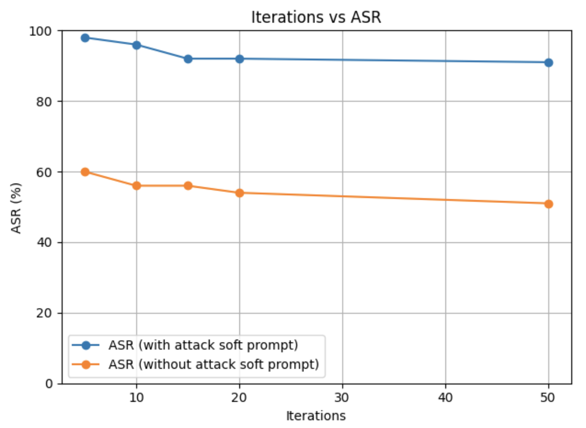

# SoftPAT: _Tune **soft** adversarial prompts._

## About

Prompt adversarial tuning (PAT) tunes intelligent prefixes for LLM prompts that nudge the LLM to refuse generating harmful content. _Soft_ prompt adversarial tuning (SoftPAT) generalizes this idea to the embedding space, revealing the presence of more powerful attacks and generating attempts to defend against them.

Specifically, PAT trains its intelligent defensive prefixes by optimizing an attack prefix and a defense prefix in alternating steps, maximizing and minimizing the probability that the LLM outputs harmful content respectively.

## Results
Preliminary results show that SoftPAT learns stronger attacks than those learned with PAT. Whereas traditional GCG attacks succeed against our defenses ~50% of the time, GCG attacks accompanied with SoftPAT's attack prompts succeed ~90% of the time.

**Figure 1.** Attack Success Rate (ASR) of GCG attacks with and without attack prompt learned with SoftPAT.

## Further Work

**This research is a work in progress.** The strength of the attack prompts produced with SoftPAT are alarming. Our current defenses are not adequate enough to defend against them. This necessitates further investigation.